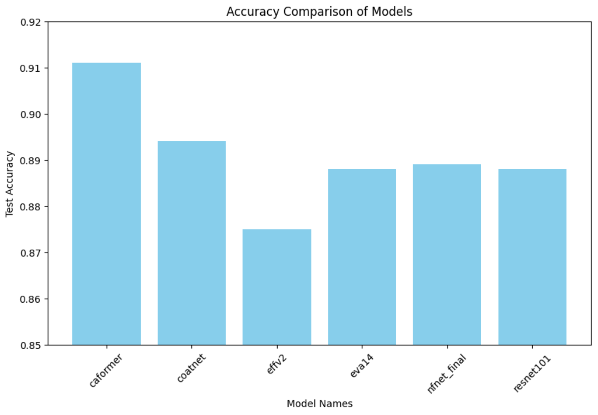
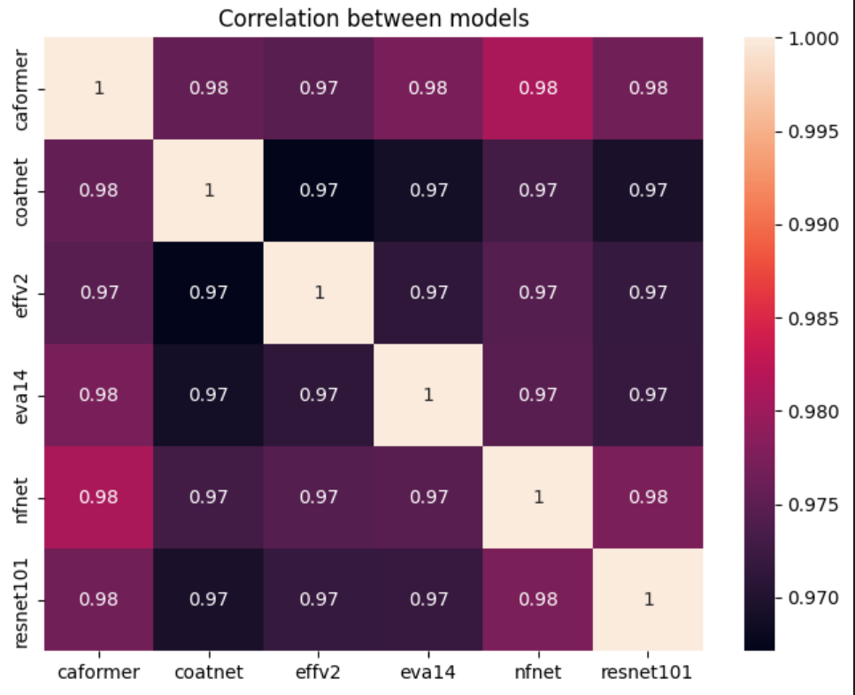

# ImageNet Sketch 분류

이 프로젝트는 Timm 라이브러리의 모델과 Albumentations를 사용하여 mageNet Sketch 모델을 학습하는 방법을 제공합니다. 5-fold 교차 검증을 통해 모델을 훈련하고, 각 fold에서 가장 성능이 좋은 모델을 저장합니다. 최종적으로 저장된 모델을 이용하여 앙상블 예측을 수행합니다.

## 목차

1. [프로젝트 개요](#프로젝트-개요)
2. [필요한 환경](#필요한-환경)
3. [데이터 준비](#데이터-준비)
4. [학습 절차](#학습-절차)
5. [Train 모델 성능 비교](#train-모델-성능-비교)
6. [추론 및 앙상블](#추론-및-앙상블)

---

## 프로젝트 개요

이 프로젝트는 Timm을 사용해 다양한 사전 학습된 모델을 활용하고, Albumentations로 데이터 증강을 수행합니다. 

- 이미지 데이터를 로드
- K-Fold 교차 검증 (stratified sampling 사용)을 적용
- Timm에서 제공하는 사전 학습된 모델을 활용하여 학습과 검증을 진행
- 클래스 불균형 문제를 다루기 위해 Focal Loss를 사용
- 각 fold에서 가장 성능이 좋은 모델을 저장
- 저장된 모델을 사용하여 앙상블 예측을 수행
- 예측 결과를 CSV 파일로 저장하여 추가 평가에 활용

---

## 필요한 환경

다음과 같은 패키지와 환경이 필요합니다.
- Python
- PyTorch
- Timm
- Albumentations
- OpenCV
- Pandas
- Scikit-learn
- TQDM

아래 명령어로 필요한 패키지를 설치할 수 있습니다.

```bash
pip install -r requirements.txt
```

---
## 데이터 준비
1. 학습 데이터 구조
학습 데이터는 data/train 폴더에 이미지 파일로 저장되며, 각 이미지에 대한 메타데이터는 train.csv 파일에 저장됩니다.
    - train.csv는 두 개의 열을 포함
    - image_path: 이미지 파일 경로
    - target: 해당 이미지의 클래스 레이블

2. 추론 데이터 구조
추론을 위한 데이터는 data/test 폴더에 이미지 파일로 저장되며, test.csv 파일에 각 이미지의 경로 정보가 저장됩니다.
&nbsp;
[데이터셋 링크](https://drive.google.com/file/d/1ndQ5TLa8OEfsp-2mypHDBdSNyKaqW6qq/view?usp=sharing)


---
## 학습 절차

#### 1. 모델 설정
모델은 TimmModel 클래스를 사용하여 Timm 라이브러리에서 사전 학습된 모델을 불러옵니다. 이 모델은 미리 학습된 가중치를 활용하며, 출력 클래스를 설정하여 학습에 사용됩니다.

```python
model_selector = ModelSelector(
    model_type='timm', 
    num_classes=num_classes,
    model_name='caformer_b36.sail_in22k', 
    pretrained=True
)
model = model_selector.get_model().to(device)
```
&nbsp;
#### 2. K-Fold 교차 검증
StratifiedKFold를 사용하여 5-Fold 교차 검증을 수행합니다. 
각 fold마다 데이터셋을 분할하고, 학습과 검증을 반복합니다.
```python
skf = StratifiedKFold(n_splits=5, shuffle=True, random_state=42)
```
각 fold에서 모델은 초기화되며, 학습은 Trainer 클래스를 통해 관리됩니다.
&nbsp;
#### 3. 데이터 증강
Albumentations를 사용하여 훈련 이미지에 대한 다양한 데이터 증강을 적용합니다. 
```python
A.HorizontalFlip(p=0.5), 
A.Rotate(limit=30),
A.CoarseDropout(max_holes=8, max_height=16, max_width=16, p=0.5), 
A.GridDistortion(num_steps=1, distort_limit=(-0.03, 0.05), interpolation=2, border_mode=0, value=(255, 255, 255), p=1) 
A.Resize(224, 224), 
UnsharpMask(kernel_size=7, sigma=1.5, amount=1.5, threshold=0, p=1.0),  
A.RandomBrightnessContrast(brightness_limit=(-0.2, -0.2), contrast_limit=0, p=1.0), 
A.Normalize(mean=[0.485, 0.456, 0.406], std=[0.229, 0.224, 0.225]),           
```
&nbsp;
#### 4. 손실 함수
클래스 불균형 문제를 해결하기 위해 Focal Loss를 사용합니다. Focal Loss는 작은 확률 값을 가지는 잘못된 예측에 더 큰 가중치를 부여하여 모델이 어려운 예측을 더 잘 수행할 수 있도록 만듭니다.
```python
loss_fn = FocalLoss(alpha=0.5, gamma=2)
```

---
### Train 모델 성능 비교
여러 딥러닝 모델에 대한 정확도를 비교하기 위한 실험을 진행하였으며, 각각의 모델이 테스트 데이터에서 얼마나 높은 정확도를 보였는지 그래프를 통해 시각화하였습니다. 아래 이미지는 실험에서 사용된 6개의 모델에 대한 정확도 비교 결과입니다.

#### 결과 해석
Caformer 모델은 다른 모델들에 비해 가장 높은 성능을 보여 주었으며, 이는 해당 모델이 실험 데이터셋에서 가장 잘 일반화된 모델을 의미합니다.
Effv2 모델은 가장 낮은 성능을 보였으나, 여전히 87.50%의 정확도를 기록하여 다른 모델들과 큰 차이는 없었습니다.
Coatnet, Eva14, Nfnet_final, 그리고 Resnet101 모델들은 서로 유사한 정확도를 기록했으며, 모두 88% 이상의 성능을 보였습니다.

&nbsp;
#### 모델 간 상관 관계 분석
다음 히트맵은 실험에 사용된 6개의 모델 간 상관 관계를 나타냅니다.



히트맵은 모델 간의 상관 관계를 색상으로 시각화한 것입니다. 
값이 1에 가까울수록 두 모델의 예측이 더 유사함을 의미합니다.
Caformer 모델은 대부분의 다른 모델들과 높은 상관 관계를 보였으며,
Effv2 모델은 다른 모델들에 비해 약간 낮은 상관 관계를 보였습니다.
Caformer, Coatnet, Nfnet_final, Resnet101_888 모델들은 서로 높은 상관 관계를 나타내고 있으며, 
이는 이 모델들이 유사한 예측 패턴을 가질 가능성을 시사 합니다.

----
### 추론 및 앙상블
각 fold에서 가장 좋은 성능을 보인 모델을 저장한 후, 해당 모델들을 사용하여 앙상블 방식으로 예측을 수행합니다. 각 모델의 예측 결과를 평균 내어 최종 예측을 결정합니다.
작업 과정
1. 데이터 로드
    학습 데이터(train.csv)와 테스트 데이터(test.csv)를 로드하여 모델 예측에 필요한 데이터를 준비합니다.
2. 모델 예측 결과 로드
    각 모델의 예측 결과를 각각 ./csv/output_모델명.csv 파일에서 읽어옵니다.
    각 모델의 예측 결과를 sub_list라는 DataFrame에 저장합니다.
